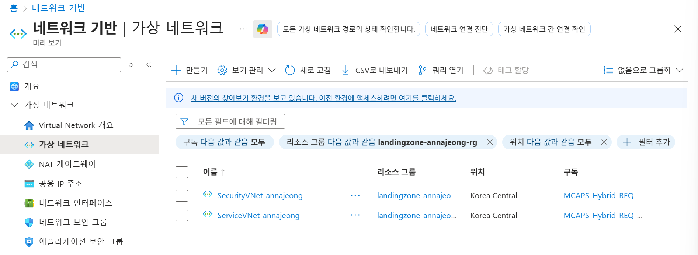

# Network Resource Deploy

## 리소스 그룹 생성

1. 리소스 그룹 메뉴로 이동합니다.
2. 왼쪽 상단 만들기 버튼을 클릭합니다.
3. 리소스 그룹 이름에 `langdingzone-<alias>-rg` 를 입력하고 영역에 `(Asia Pacific) Korea Central`을 선택합니다.
4. 검토+만들기 버튼을 클릭 후, 만들기 버튼을 클릭합니다.

## Virtual WANs 구성

### Virtual WANs 생성

1. **Virtual WANs 메뉴**로 이동합니다.
2. 왼쪽 상단 `만들기` 버튼을 클릭합니다.
3. 다음과 같이 설정 후, 검토+만들기 버튼을 클릭하고 만들기 버튼을 클릭합니다.
    - 구독 : 할당 받은 구독 선택
    - 리소스 그룹 : 생성한 본인 리소스 그룹 선택
    - 지역 : Korea Central
    - 이름 : `VirtualWAN-<alias>`
    - 유형 : 표준

### Virtual Hub 생성

1. 리소스가 생성되면 `리소스로 이동` 버튼을 클릭합니다.
2. 왼쪽 메뉴에서 `연결 > 허브`를 선택하고 상단에 `새 허브` 버튼을 클릭합니다.
3. 다음과 같이 설정 후 검토 만들기 버튼을 클릭합니다.
    - 지역 : Korea Central
    - 이름 : `VirtualHub-<alias>`
    - 허브 프라이빗 주소 공간 : 10.0.0.0/16
    - 가상 허브 용량 : 2 라우팅 인프라 단위, 3 Gbps 라우터, 2000개 VM 지원
    - 허브 라우팅 기본 설정 : ExpressRoute
4. 만들기 버튼을 클릭합니다.

> 리소스가 생성되는 동안 화면을 이동하여도 리소스는 계속해서 배포됩니다.
> 

## 가상 네트워크 구성

### 보안 네트워크 생성

1. 브라우저 새 탭에서 [Azure Portal](https://portal.azure.com)을 엽니다.
2. **가상 네트워크 메뉴**로 이동합니다.
3. 왼쪽 상단 `만들기` 버튼을 클릭합니다.
4. 다음과 같이 설정 후 `다음` 버튼 클릭합니다.
    - 구독 : 할당 받은 구독 선택
    - 리소스 그룹 : 생성한 본인 리소스 그룹 선택
    - 가상 네트워크 이름 : `SecurityVNet-<alias>`
    - 지역 : (Asia Pacific) Korea Central
5. 기본 설정을 그대로 두고 `다음` 버튼을 클릭합니다.
6. IP 주소 탭에서 CIDR 공간을 지정합니다.
    - 가상 네트워크 CIDR : 10.1.0.0/16
    - default 서브넷의 `연필 모양 아이콘`을 클릭하여 서브넷을 수정합니다.
        - 서브넷 용도 : Default
        - 이름 : `AGWSubnet`
        - 나머지 설정은 그대로 두고 `저장` 버튼 클릭
7. `검토+만들기` 버튼을 클릭하고 만들기 버튼을 클릭합니다.

### 서비스 네트워크 생성

1. 다시 `가상 네트워크 메뉴`로 이동합니다.
2. 동일하게 아래와 같이 가상 네트워크를 설정합니다.
    - 가상 네트워크 이름 : `ServiceVNet-<alias>`
    - 가상 네트워크 CIDR : 10.2.0.0/16
    - 서브넷 설정
        - 서브넷 용도 : Default
        - 이름 : `AppSubnet`

