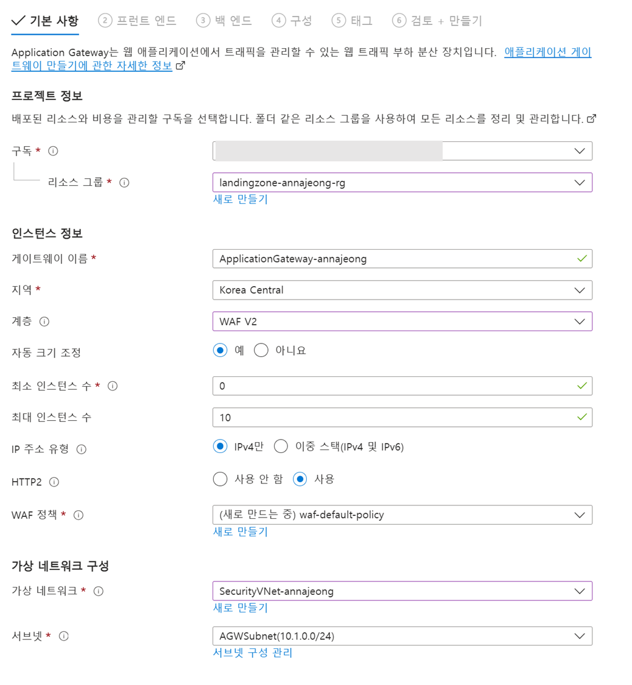

# 2. 보안 리소스 배포

## 애플리케이션 게이트웨이 생성

1. `Application gateways 화면`으로 이동합니다.
2. 왼쪽 상단 `만들기` 버튼을 클릭합니다.
    
    **기본 사항 구성**
    
    
    
    - 구독 : 할당 받은 구독 선택
    - 리소스 그룹 : 생성한 본인 리소스 그룹 선택
    - 게이트웨이 이름 : `ApplicationGateway-<alias>`
    - 지역 : Korea Central
    - 계층 : WAF V2
    - 자동 크기 조정 : 예
        - 최소 인스턴수 수 : 0
        - 최대 인스턴스 수 : 10
    - IP 주소 유형 : IPv4만
    - HTTP2 : 사용
    - WAF 정책 : `새로 만들기` 클릭
        - 이름 : `waf-default-policy`
        - `확인` 버튼 클릭
    - 가상 네트워크 : `SecurityVNet-<alias>`
    - 서브넷 : `AGWSubnet`
3. `다음: 프런트 엔드 >` 버튼을 클릭합니다.
    
    **프런트 엔드 구성**
    
    
    
    - 프런트 엔드 IP 형식 : 공용
    - 공용 IPv4 주소 : `새로 추가` 클릭
        - 이름 : `AGWPIP-<ALIAS>`
        - `확인` 버튼 클릭

1. `다음: 백 엔드 >` 버튼을 클릭합니다.
    
    **백 엔드 구성**
    
    
    
    `백 엔드 풀 추가` 클릭
    
    - 이름 : backend-pool
    - `추가` 버튼 클릭
2. `다음: 구성 >` 버튼을 클릭합니다.
3. `회람 규칙 추가` 버튼을 클릭합니다.
    
    **회람 규칙 구성**
    
    
    
    - 규칙 이름 : http-rule
    - 우선 순위 : 100
    
    **수신기 구성**
    
    - 수신기 이름 : http-listener
    - 프런트 엔드 IP : 공용 IPv4
    - 프로토콜 : HTTP
    - 포트 : 80
    
    **백 엔드 대상 구성**
    
    
    
    - 대상 유형 : 백 엔드 풀
    - 백 엔드 대상 : backend-pool
    - 백 엔드 설정 : `새로 추가` 클릭
        
        
        
        - 백 엔드 설정 이름 : backend-config
        - 나머지 설정 그대로 두고 `추가` 버튼 클릭
    - 모든 구성 확인 후 `추가` 버튼을 클릭합니다.
4. `다음: 태그 >`, `다음: 검토 + 만들기 >` 버튼 클릭 후 구성을 확인하고 `만들기` 버튼을 클릭합니다.

### WAF 정책 확인

1. WAF(Web Application Firewall) 정책 메뉴로 이동합니다.
2. 생성한 `waf-default-policy`를 클릭합니다.
3. 왼쪽 메뉴에서 관리형 규칙을 선택합니다.
4. 개요에서 `방지 모드로 전환`을 클릭합니다.
5. 할당 버튼을 클릭하고 봇 관리 규칙 집합에서 `Microsoft_BotManagerRuleSet_1.0`을 선택하고 저장 버튼을 클릭합니다.

## 방화벽 배포

### AzureFirewallSubnet 서브넷 추가

1. **가상 네트워크 화면**으로 이동합니다.
2. 생성한 `SecurityVNet-<alias>` 을 선택합니다.
3. 왼쪽 메뉴에서 `설정 > 서브넷`을 클릭합니다.
4. 왼쪽 상단의 `+ 서브넷` 버튼을 클릭합니다.
5. 다음과 같이 구성하고 `추가` 버튼을 클릭합니다.
    
    
    
    - 서브넷 용도 : Azure Firewall
    - 이름 : **AzureFirewallSubnet**
    - 시작 주소 : `10.1.1.0`

### 방화벽 배포

1. **Firewalls 화면**으로 이동합니다.
2. 왼쪽 상단에 `만들기` 버튼을 클릭합니다.
3. 아래와 같이 구성합니다.
    - 구독 : 할당 받은 구독 선택
    - 리소스 그룹 : 생성한 본인 리소스 그룹 선택
    - 이름 : `Firewall-<alias>`
    - 지역 : Korea Central
    - 방화벽 SKU : 표준
    - 방화벽 관리 : 방화벽 정책을 사용하여 이 방화벽 관리
    - Firewall policy : `Add new` 클릭
        - 정책 이름 : `default-fw-policy`
        - `확인` 버튼 클릭
    - 가상 네트워크 선택 : 기존 항목 사용
    - 가상 네트워크 : `SecurityVNet-<alias>`
    - 공용 IP 주소 : `새로 추가` 클릭
        - 이름 : `FWPIP-<ALIAS>`
        - **확인** 버튼 클릭
    - `Enable Firewall Management NIC 체크박스 해제`
4. `다음: 태그>` 버튼을 클릭합니다.
5. `다음: 검토 + 만들기 >` 버튼을 클릭하고 `만들기` 버튼을 클릭합니다.