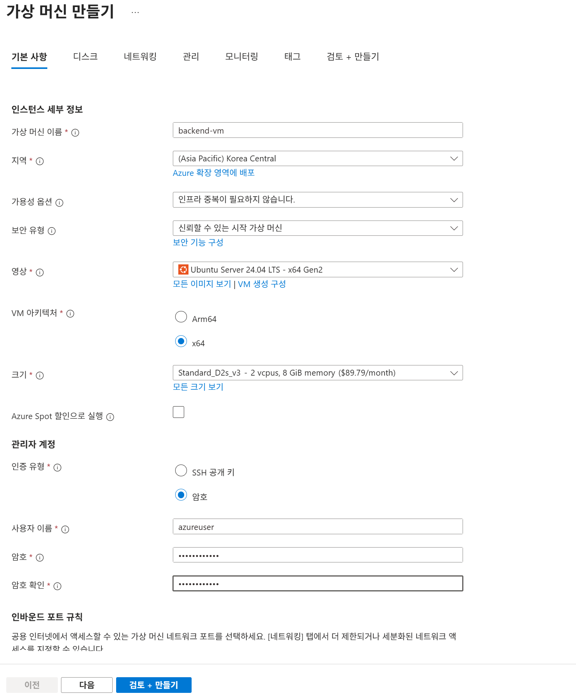
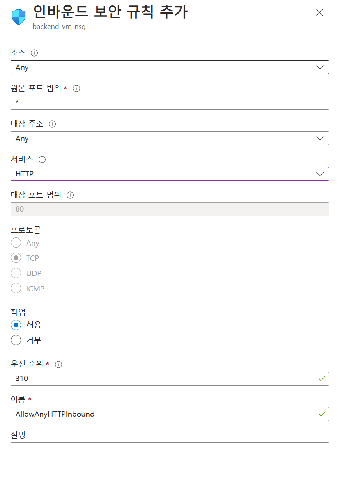

# 4. 테스트 리소스 배포

## 가상 머신 생성

1. **가상 머신 화면**으로 이동합니다.
2. 왼쪽 상단의 `만들기` 버튼을 클릭하고 `가상 머신`을 선택합니다.
3. 아래와 같이 설정합니다.
    
    
    
    - 구독 : 할당 받은 구독 선택
    - 리소스 그룹 : 생성한 본인 리소스 그룹 선택
    - **인스턴스 세부 정보**
        - 가상 머신 이름 : backend-vm
        - 지역 : (Asia Pacific) Korea Central
        - 가용성 옵션 : 인프라 중복이 필요하지 않습니다.
        - 보안 유형 : 신뢰할 수 있는 시작 가상 머신
        - 이미지 : Ubuntu Server 24.04 LTS - x64 Gen2
        - VM 아키텍처 : x64
        - 크기 : Standard_D2s_v3
    - 관리자 계정
        - 인증 유형 : 암호
        - 사용자 이름 : azureuser
        - 암호 : Workshop12!@
4. 나머지 설정은 그대로 두고 `다음` 버튼을 클릭합니다.
5. 디스크 설정은 그대로 두고 `다음` 버튼을 클릭합니다.
6. 네트워킹 탭을 아래와 같이 구성합니다.
    
    
    
    - 가상 네트워크 : `ServiceVNet`
    - 서브넷 : `AppSubnet`
    - 공용 IP : (신규) backend-vm-ip
7. 나머지 설정은 그대로 두고 `검토 + 만들기` 버튼을 클릭하여 가상 머신을 생성합니다.

## 샘플 애플리케이션 구성

1. 로컬 환경에서 터미널을 열고 아래 명령어를 이용하여 가상 머신에 접속합니다.
    
    ```bash
    ssh azureuser@<VM 공용 아이피>
    ```
    
2. 아래 명령어를 사용하여 도커 컨테이너를 설치합니다.
    
    ```bash
    sudo apt update
    sudo apt install docker.io
    ```
    
3. 아래 명령어를 사용하여 애플리케이션을 띄웁니다.
    
    ```bash
    sudo docker container run -d --name juice_shop --rm -p 80:3000 bkimminich/juice-shop
    ```
    

### 네트워크 설정

1. **생성한 가상 머신 화면**으로 이동합니다.
2. 왼쪽 메뉴에서 `네트워크 설정`을 클릭합니다.
3. 아래 규칙에서 `포트 규칙 만들기` 버튼을 클릭하고 `인바운드 포트 규칙`을 클릭합니다.
4. 다음과 같이 구성 후 `추가` 버튼을 클릭합니다.
    
    
    
5. 왼쪽 메뉴에서 `개요`를 클릭한 뒤, `VM의 공용 IP`를 복사합니다.

    

6. 브라우저에서 새 탭을 열고 복사한 공용 IP를 붙여넣고 애플리케이션이 정상 동작하는지 확인합니다.

    
    
### 애플리케이션 게이트웨이 연결
    
1. **애플리케이션 게이트웨이 화면**으로 이동 후 `생성한 애플리케이션 게이트웨이`를 클릭합니다.
2. 왼쪽 메뉴에서 `백 엔드 풀`을 클릭합니다.
3. 생성한 `backend-pool`을 클릭합니다.
4. 하단 백 엔드 대상에서 대상 유형을 가상 머신을 선택하고 생성한 `backend-vm`을 선택합니다.
5. `저장` 버튼을 클릭합니다.