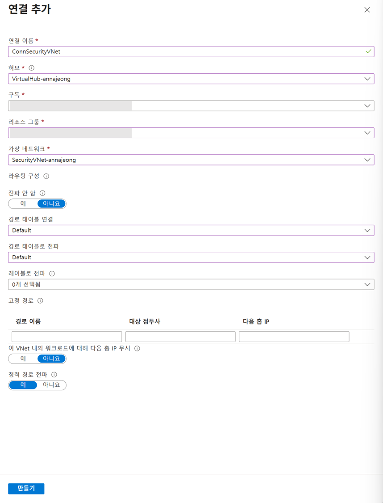

# 5. 네트워크 연결 구성

## Application Gateway 백엔드 풀 설정

1. **애플리케이션 게이트웨이 메뉴**로 이동합니다.
2. 생성한 `ApplicationGateway`를 클릭합니다.
3. 왼쪽 메뉴에서 `백 엔드 풀`을 선택합니다.
4. `backend-pool`을 클릭합니다.
5. 대상 유형에서 `IP 주소 또는 FQDN`을 클릭하고  복사해둔 `backend-vm`의 프라이빗 IP 주소를 입력합니다.
6. `저장` 버튼을 클릭합니다.

## Virtual Hub 구성

1. `Virtual WANs` 화면으로 이동합니다.
2. 생성한 `VirtualWAN`을 클릭합니다.
3. 왼쪽 메뉴에서 `연결 > 가상 네트워크 연결`을 클릭합니다.
4. 상단의 `연결 추가` 버튼을 클릭합니다.
5. 아래와 같이 구성합니다.
    
    
    
    - 연결 이름 : ConnSecurityVNet
    - 허브 : VirtualHub
    - 구독 : 할당 받은 구독 선택
    - 리소스 그룹 : 생성한 본인 리소스 그룹 선택
    - 가상 네트워크 : SecurityVNet
    - 전파 안 함 : 아니요
    - 경로 테이블 연결 : Default
    - 경로 테이블로 전파 : Default
6. 구성이 끝나면 `만들기` 버튼을 클릭합니다.
7. 동일한 방법으로 `ServiceVNet`도 연결합니다.
    - 연결 이름 : ConnServiceVNet
    - 가상 네트워크 : ServiceVNet

## 방화벽 규칙 구성

다음 정보를 기록합니다.

- `SecurityVNet/AGWSubnet`의 CIDR (10.1.0.0/24)
- `ServiceVNet/AppSubnet`의 CIDR (10.2.0.0/24)
- 방화벽의 개인 IP (10.1.1.4)

1. Firewall을 입력하여 **네트워크 보안 | Azure Firewall 화면**으로 이동합니다.
2. 생성한 `Firewall`을 클릭합니다.
3. 개요 하단에 Firewall policy에서 생성한 `default-fw-policy`를 클릭합니다.
4. 왼쪽 메뉴에서 `Rules > 네트워크 규칙`을 선택합니다.
5. 규칙 컬렉션 추가 버튼을 클릭하고 아래 두 개의 규칙을 구성합니다.

### AppGW-to-Backend Rule

- 이름 : app-rules
- 규칙 컬렉션 형식 : 네트워크
- 우선 순위 : 1000
- 규칙 컬렉션 작업 : 허용
- 규칙 컬렉션 그룹 : DefaultNetworkRuleCollectionGroup
- 규칙
    - 이름 : AppGW-to-Backend
    - 원본 : <AGWSubnet의 CIDR>
    - 프로토콜 : 모두
    - 대상 포트 : *
    - 대상 유형 : IP 주소
    - 대상 : <AppSubnet의 CIDR>

> 규칙이 추가된 후, 다음 작업을 진행해야 합니다.
> 

### Backend-to-AppGW Rule

- 이름 : appgw-rules
- 규칙 컬렉션 형식 : 네트워크
- 우선 순위 : 1001
- 규칙 컬렉션 작업 : 허용
- 규칙 컬렉션 그룹 : DefaultNetworkRuleCollectionGroup
- 규칙
    - 이름 : Backend-to-AppGW
    - 원본 : <AppSubnet의 CIDR>
    - 프로토콜 : 모두
    - 대상 포트 : *
    - 대상 유형 : IP 주소
    - 대상 : <AGWSubnet의 CIDR>
    

## 경로 테이블 구성

1. 경로 테이블을 입력하여 **네트워크 기반 | 경로 테이블 화면**으로 이동합니다.
2. 아래 두 개의 경로 테이블을 구성합니다.

### app-udr

1. `만들기` 버튼을 클릭합니다.
2. 다음과 같이 구성 후 `검토 + 만들기`, `만들기` 버튼을 클릭합니다.
    - 구독 : 할당 받은 구독 선택
    - 리소스 그룹 : 생성한 본인 리소스 그룹 선택
    - 지역 : Korea Central
    - 이름 : app-udr
    - 게이트웨이 경로 전파 : Yes
3. **생성된 경로 테이블 화면**으로 이동합니다.
4. 왼쪽 메뉴에서 `설정 > 경로`를 선택합니다.
5. `추가` 버튼을 클릭합니다.
6. 다음과 같이 구성 후, `추가` 버튼을 클릭합니다.
    - 경로 이름 : firewall
    - 대상 유형 : IP 주소
    - 대상 IP주소/CIDR 범위 : <AGWSubnet의 CIDR>
    - 다음 홉 형식 : 가상 어플라이언스
    - 다음 홉 주소 : <방화벽의 개인 IP>
7. 왼쪽 메뉴에서 `설정 > 서브넷`을 선택합니다.
8. `연결` 버튼을 클릭합니다.
9. 서브넷 연결에서 가상 네트워크를 `ServiceVNet`, 서브넷을 `AppSubnet`으로 선택하고 확인 버튼을 클릭합니다.

### appgw-udr

1. `만들기` 버튼을 클릭합니다.
2. 다음과 같이 구성 후 `검토 + 만들기`, `만들기` 버튼을 클릭합니다.
    - 구독 : 할당 받은 구독 선택
    - 리소스 그룹 : 생성한 본인 리소스 그룹 선택
    - 지역 : Korea Central
    - 이름 : appgw-udr
    - 게이트웨이 경로 전파 : Yes
3. **생성된 경로 테이블 화면**으로 이동합니다.
4. 왼쪽 메뉴에서 `설정 > 경로`를 선택합니다.
5. `추가` 버튼을 클릭합니다.
6. 다음과 같이 구성 후, 추가 버튼을 클릭합니다.
    - 경로 이름 : to-firewall
    - 대상 유형 : IP 주소
    - 대상 IP주소/CIDR 범위 : <AppSubnet의 CIDR>
    - 다음 홉 형식 : 가상 어플라이언스
    - 다음 홉 주소 : <방화벽의 개인 IP>
7. 왼쪽 메뉴에서 `설정 > 서브넷`을 선택합니다.
8. `연결` 버튼을 클릭합니다.
9. 서브넷 연결에서 가상 네트워크를 `SecurityVNet`, 서브넷을 `AGWSubnet`으로 선택하고 `확인` 버튼을 클릭합니다.