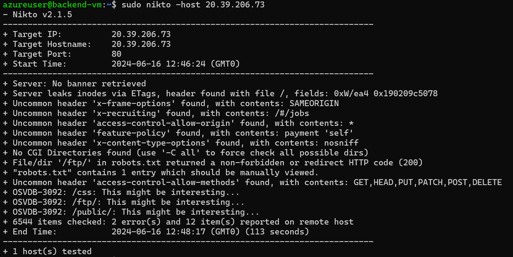

# 6. 시나리오 테스트

## 구성 테스트

1. **애플리케이션 게이트웨이 화면**으로 이동합니다.
2. `ApplicationGateway`를 클릭하고 `프런트 엔드 공용 IP` 주소를 복사합니다.
3. 브라우저 새 탭에서 해당 아이피를 붙여넣고 정상적으로 화면이 보이면 정상적으로 구성이 완료된 것입니다.

## **Reconnaissance**

### Install Nikto

```bash
sudo apt install nikto -y
```

### Scan Web Server

```bash
sudo nikto -host <VM의 공용 아이피>
```



### Scan Web Server with WAF

```bash
sudo nikto -host <애플리케이션 게이트웨이의 공용 IP>
```


### IP별 일치/차단된 요청

```sql
AzureDiagnostics
| where ResourceProvider == "MICROSOFT.NETWORK" and Category == "ApplicationGatewayFirewallLog"
| summarize count() by clientIp_s, bin(TimeGenerated, 1m)
| render timechart
```

### URI별 일치/차단된 요청

```sql
AzureDiagnostics
| where ResourceProvider == "MICROSOFT.NETWORK" and Category == "ApplicationGatewayFirewallLog"
| summarize count() by requestUri_s, bin(TimeGenerated, 1m)
| render timechart
```

## Port Scan

### Install NMap

```bash
sudo apt install nmap -y
```

### Scan Port

```bash
sudo nmap -O <애플리케이션 게이트웨이의 공용 IP>
```

```sql
// All firewall decisions 
// All decision taken by firewall. Contains hits on network, application and NAT rules, as well as threat intelligence hits and IDPS signature hits. 
AZFWNetworkRule
| union AZFWApplicationRule, AZFWNatRule, AZFWThreatIntel, AZFWIdpsSignature
| order by TimeGenerated desc 
| take 100
```