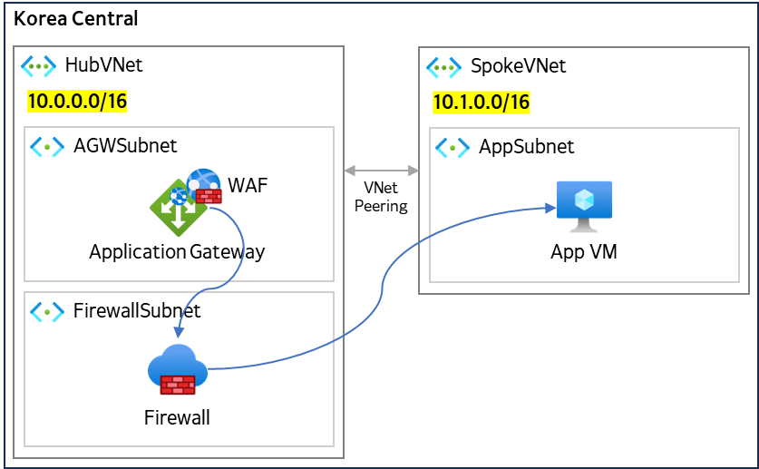

# Azure Landing Zone Hands-on Workshop

이 워크숍은 **Azure Landing Zone의 기본 네트워크 및 보안 아키텍처를 직접 구축해보는 Hands-on Lab**입니다.

참가자는 **Hub-Spoke 네트워크 아키텍처**를 기반으로 Azure 환경을 구성하고,  
**Azure Firewall, Application Gateway (WAF), User Defined Route**를 활용하여  
기업 환경에서 사용되는 **중앙 집중형 보안 네트워크 구조**를 구현합니다.

워크숍을 통해 Azure에서 **보안 경계, 트래픽 흐름, 네트워크 거버넌스**를 실제로 구성하고 검증할 수 있습니다.

---

## 🎯 Workshop Objectives

이 워크숍을 완료하면 다음을 이해할 수 있습니다.

- Azure Landing Zone의 기본 네트워크 구조
- Hub-Spoke 네트워크 아키텍처
- 중앙 보안 제어 (Azure Firewall)
- Application Gateway WAF 기반 Inbound 보호
- User Defined Route를 통한 트래픽 제어
- Azure 네트워크에서의 트래픽 흐름 검증 방법

---

## 🏗 Architecture Overview

이 워크숍에서는 다음과 같은 아키텍처를 구축합니다.

Internet  
↓  
Application Gateway (WAF)  
↓  
Azure Firewall  
↓  
Spoke VNet (Backend VM)

| 구성 요소 | 역할 |
|---|---|
| Hub VNet | 중앙 보안 및 트래픽 제어 영역 |
| Spoke VNet | 애플리케이션 워크로드 실행 영역 |
| Azure Firewall | Inbound, Outbound, East-West 트래픽 검사 및 제어 |
| Application Gateway WAF | 외부 웹 요청에 대한 L7 진입점 및 WAF 보호 |
| UDR | Spoke 트래픽을 Azure Firewall로 강제 라우팅 |

---

## 📋 Prerequisites

워크숍 시작 전에 다음이 필요합니다.

- Azure Subscription
- Contributor 이상의 권한
- Azure CLI 또는 Azure Portal 접근
- 기본적인 Azure Networking 이해

---

## 🛠 Workshop Workflow

| 단계 | 설명 |
|------|------|
| 1 | Resource Group 생성 |
| 2 | Hub VNet 및 Spoke VNet 생성 |
| 3 | Hub-Spoke VNet Peering 구성 |
| 4 | Azure Firewall 배포 |
| 5 | Application Gateway (WAF) 배포 |
| 6 | Backend VM 배포 |
| 7 | User Defined Route 구성 |
| 8 | 트래픽 흐름 검증 |

---

## 🔎 Validation Steps

워크숍이 완료되면 다음을 확인합니다.

- Application Gateway를 통한 Web 접근 가능 여부
- Azure Firewall을 통한 Outbound 트래픽 검사
- UDR 적용 여부
- 트래픽이 Hub Firewall을 통과하는지 확인

---

## 🧹 Cleanup

워크숍 종료 후 리소스를 삭제하여 비용 발생을 방지합니다.

az group delete --name <resource-group-name>

또는 Azure Portal에서 Resource Group을 삭제합니다.

---

## 📚 References

Azure Landing Zone Architecture  
https://learn.microsoft.com/azure/cloud-adoption-framework/ready/landing-zone/

Azure Hub-Spoke Architecture  
https://learn.microsoft.com/azure/architecture/reference-architectures/hybrid-networking/hub-spoke

Azure Firewall  
https://learn.microsoft.com/azure/firewall/

Application Gateway WAF  
https://learn.microsoft.com/azure/application-gateway/

---

## 📜 License

이 워크숍 리포지토리는 MIT License 하에 배포됩니다.