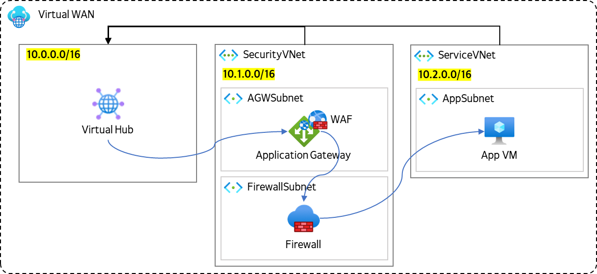

# Azure Advanced Network Workshop

Azure Virtual WAN은 많은 네트워킹, 보안 및 라우팅 기능을 결합하여 단일 운영 인터페이스를 제공하는 네트워킹 서비스입니다. Azure Virtual WAN을 사용한 Azure WAF, Firewall을 적용한 Azure Landing Zone의 가장 기본적인 네트워크 구성을 만듭니다.

**Contents**

[Network Resource Deploy](https://github.com/Anna-Jeong-MS/AzureAdvancedNetworkWorshop/tree/main/1_Network_Resource_Deploy)

[Security Resource Deploy](https://github.com/Anna-Jeong-MS/AzureAdvancedNetworkWorshop/tree/main/2_Security_Resource_Deploy)

[Test Resource Deploy](https://github.com/Anna-Jeong-MS/AzureAdvancedNetworkWorshop/tree/main/3_Test_Resource_Deploy)

[Network Connectivity](https://github.com/Anna-Jeong-MS/AzureAdvancedNetworkWorshop/tree/main/4_Network_Connectivity)

**References**

[https://learn.microsoft.com/ko-kr/azure/virtual-wan/virtual-wan-about](https://learn.microsoft.com/ko-kr/azure/virtual-wan/virtual-wan-about)